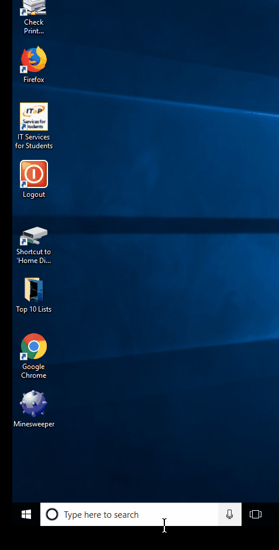
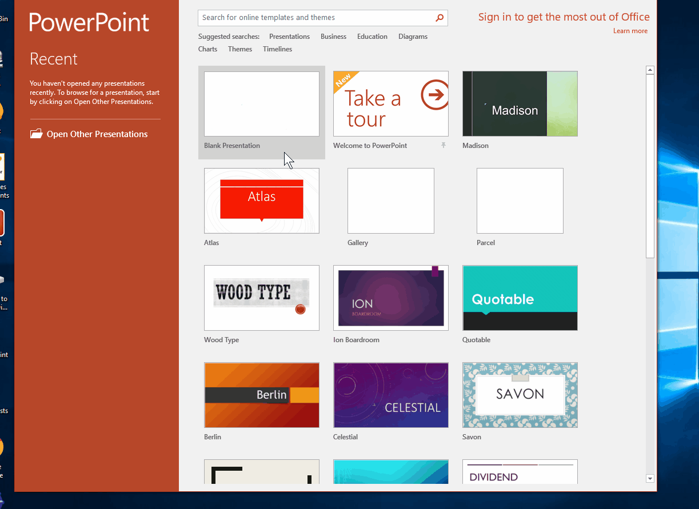
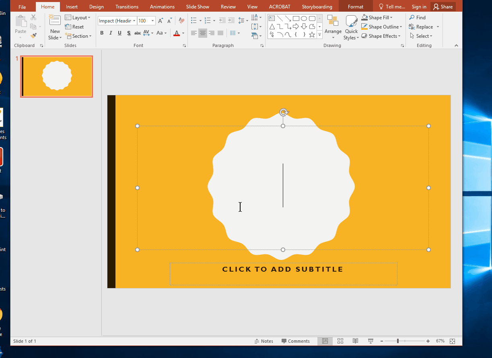
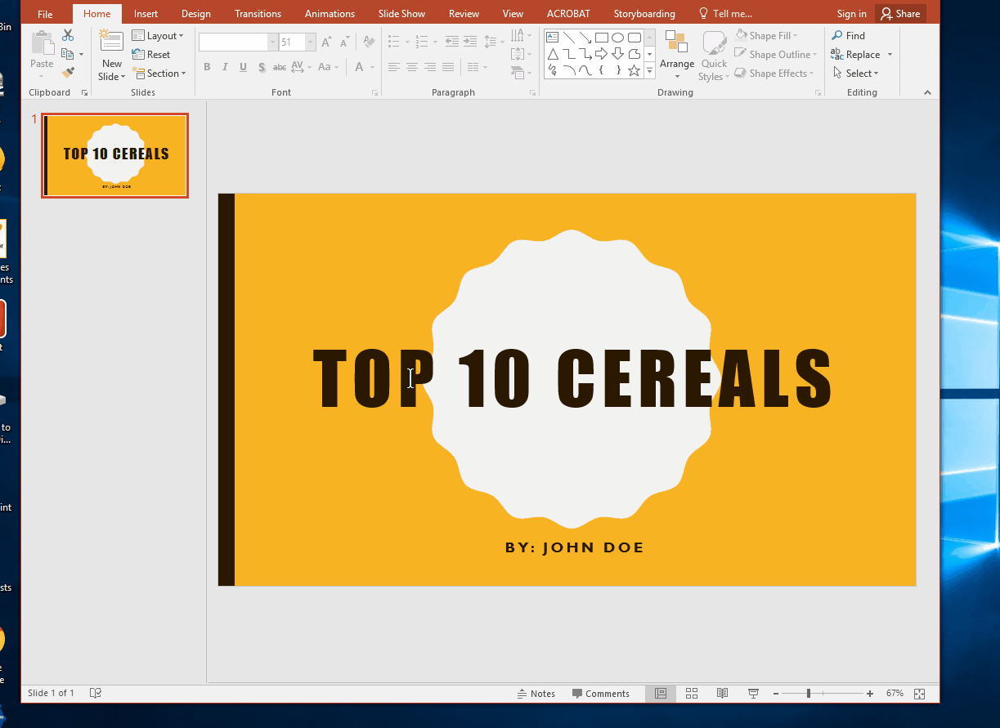
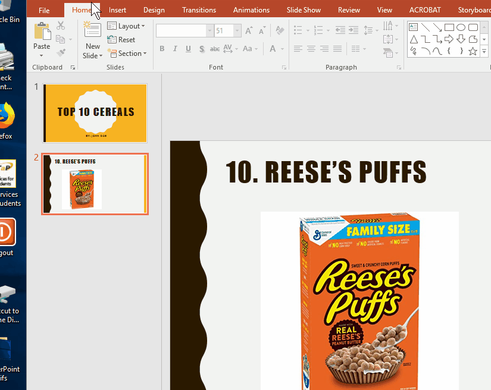

# Top 10 List

## Description
Kids wil become familiar with using Powerpoint by creating a **Top 10 List**.

## Example:
**[Top 10 Cereals](https://anirudhpal.github.io/PALS_CS_2018/Examples/Top_10_Cereals.pdf)**

## Step 1: Open Microsoft Powerpoint
In Cortona, type _Powerpoint_ and click _Powerpoint 2016_.

## Step 2: Choose your Theme
Double click the theme of your choice.

## Step 3: Make Title Slide
Type the name of the title of your top 10 List.

## Step 4: Add and Edit New Slide
Add a new slide and edit it.

## Step 5: Repeat
Repeat **Step 4** until your _Top 10 List_ is complete.

## Step 6: Save
Save your file as your name

